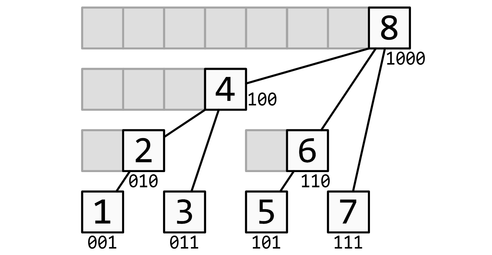

# 二叉索引树（Binary Indexed Tree）

## 简介

二叉索引树（Binary Indexed Tree）又称树状数组，其发明者又称为Fenwick树。

如果说是二叉索引树，我觉得称之为二进制索引树更为合适，至于为什么，在后面你就能够体会到他的奇妙之处。

最早由Peter M. Fenwick于1994年以《A New Data Structure for Cumulative Frequency Tables》为题发表在SOFTWARE PRACTICE AND EXPERIENCE。
其初衷是解决数据压缩里的累积频率（Cumulative Frequency）的计算问题，现多用于高效计算数列的前缀和、区间和。

所以一般在算法题中求前缀和、前缀积、前缀最大最小的场景就非常适合使用二叉索引树来进行解答。

**值得注意的是能用树状数组解决的问题都可以用其他的解法（例如线段树）来进行解答，反之则不成立。但是这仍不妨碍我们来学习树状数组，因为线段树相对树状数组来说更加复杂，简单的题型使用树状数组往往更合适，主要是学习其中的方法**

### lowBit

二叉索引树之所以又称为树状数组，是因为这棵树只是逻辑上的树结构，实际上仍然是一个数组的形式存在。



可以看到上图，实际上是一个空间为8的数组，只是逻辑上是一棵拥有八个节点的二叉树。而每个节点都管理着他的子节点。

例如：

```
c1 = a1
c2 = c1 + a2 = a1 + a2
c3 = a3
c4 = c2 + c3 + a4 = a1 + a2 + a3 + a4
c5 = a5
c6 = c5 + a6 = a5 + a6
c7 = a7
c8 = c4 + c6 + c7 + a8 = a1 + a2 + a3 + a4 + a5 + a6 + a7 + a8
```

其中，a为原数组，c为构建好后的数组，即二叉索引树。

例如：
c4 = c2 + c3 + a4 = a1 + a2 + a3 + a4

第四个节点掌管本身的节点即a4，还有其两个子节点a2、a3，而a2还掌管着a1、a2，所以c4一共掌管a1、a2、a3、a4四个节点。

那么，怎么知道自己掌管哪些节点呢？

可以采用 `原码 & 补码` 的方法找到他的所管理的节点区间。

```
X -> 二进制-> 取值后-> 节点位置
1 -> 01   -> 1    -> 1
2 -> 10   -> 10   -> 2
3 -> 11   -> 1    -> 1
4 -> 100  -> 100  -> 4
5 -> 101  -> 1    -> 1
6 -> 110  -> 10   -> 2
7 -> 111  -> 1    -> 1
8 -> 1000 -> 1000 -> 8
```

例如，节点4，取值后为100，对应的节点位置为4，所以他掌管着包括自己的前四个节点。

所以就有了`lowBit`函数：

```go
// lowBit 取值：取最低位1及后面所有的0所表达的数（a[i]所管理的数的数量）
// 例如：
// X -> 二进制-> 取值后->
// 1 -> 01   -> 1    -> 1
// 2 -> 10   -> 10   -> 2
// 3 -> 11   -> 1    -> 1
// 4 -> 100  -> 100  -> 4
// 5 -> 101  -> 1    -> 1
// 6 -> 110  -> 10   -> 2
// 7 -> 111  -> 1    -> 1
// 8 -> 1000 -> 1000 -> 8
func lowBit(index int) int {
// 原码 & 补码（原码按位取反加一）
// 6 -> 110 & 010 -> 10 -> 2
return index & -index
}
```
`lowBit`贯穿整个树状数组。

- 对于某个节点，如果要找到他左邻居，只需要`i - lowBit(i)`
- 某个节点的父节点：`i + lowBit(i)`

### sum

如果说我要计算原数组a4 - a8之间的元素只和，利用树状数组，那么只需要将前八个节点的树减去前三个节点的值即可，换作公式：

```
a4 + a5 + a6 + a7 + a8 = sumRange(1,8) - sumRange(1,3)
```

前八个元素之和已经存在c8之中，那么前三个元素之和怎么算呢？

可以通过图可以知道，其实sum(1,3)并没有保存在c3中，而是`sumRange(1,3) = a1 + a2 + a3 = c2 + c3`

那么怎么通过c3去获取到c2呢？

其实c2就是c3的左邻居节点，那么只需要`3 - lowBit(3)`就能获取到c2的值了。

然而实际情况不是只有一个节点的情况，可能需要计算更多次，比如`sumRange(1,7)  = a1 + a2 + a3 + a4 + a5 + a6 + a7 =  c4 + c6 + c7`。
其中c6是c7的左邻居节点，c4又恰好是c6的左邻居节点。所以我们可以通过c7获取c6，再通过c6获取c4，直到没有左邻居节点。

所以就有了`sum`函数（获取a数组，1到index的和）：
```go
// 求a[1]到a[i]的和，只需求a[i]及其之前的峰的和
func sum(index int, a []int) (ans int) {
	for index >= 1 {
		ans += a[index]
		index -= lowBit(index)
	}
	return
}
```
### initTree

那么怎么去计算已经知道，那么怎么去构建这样的一棵树呢？


再看这张图，对于数组a 其值为`[1,2,3,4,5,6,7,8]`，以及每个节点保存的值：
```
c1 = a1
c2 = c1 + a2 = a1 + a2
c3 = a3
c4 = c2 + c3 + a4 = a1 + a2 + a3 + a4
c5 = a5
c6 = c5 + a6 = a5 + a6
c7 = a7
c8 = c4 + c6 + c7 + a8 = a1 + a2 + a3 + a4 + a5 + a6 + a7 + a8
```
可以知道，对于元素a1，它会保存到 c1、c2、c4、c8，而他们恰好互为父子关系。

所以在初始化树的时候，需要将每个元素都保存到与之相关的父节点。
如a1 需要保存到c1、c2、c4、c8四个节点。

其中c2是c1的父亲节点，那么可以通过`1 + lowBit(1)`获取到c2的下标，
c4是c2的父亲节点，那么可以通过`2 + lowBit(2)`获取到c4的下标，
c8是c4的父亲节点，那么可以通过`4 + lowBit(4)`获取到c8的下标。

那么可想而至，如果需要添加一个数，那么需要不停的往父亲节点上添加，知道没有父亲节点。

所以初始化树的`initTree`函数：
```go
// 初始化当前值的同时，将自身的值累加到父亲节点
func initTree(nums []int) []int {
	l := len(nums)
	a := make([]int, l+1)
	for i := 0; i < l; i++ {
		index := i + 1
		a[index] += nums[i]
		fatherIndex := index + lowBit(index)
		if fatherIndex <= l {
			a[fatherIndex] += a[index]
		}
	}
	return a
}
```

其中需要注意的点是，因为树的下标及计算是从一开始的，而实际的原数组是从零开始的，所以在初始化的及计算的的时候需要为树增加一个前置空间c[0],该位置不保存任何数据，只是为了方便计算。

例如，数组其值为`[1,2,3,4,5,6,7,8]`，那么构建好的树为 `[0 1 3 3 10 5 11 7 36]`

详细代码见：[源代码](https://github.com/lomtom/algorithm-go/blob/main/datastruct/linear_array/linear_array_test.go)

> 细节处理：需要处理边界：
> 1. 数组长度不变，输出处理边界
> 2. 数组长度加一


[练手](https://loj.ac/p/130)：
>给定数列 ，你需要依次进行  个操作，操作有两类：
>
> 1 i x：给定 ，将  加上 ；
> 
> 2 l r：给定 ，求  的值（换言之，求  的值）。
> 
> 
> [答案](https://github.com/lomtom/algorithm-go/blob/main/datastruct/linear_array/interval_sum/main.go)

## 树状数组应用

### 简单
- [区域和检索 - 数组不可变](https://leetcode-cn.com/problems/range-sum-query-immutable/)-
- [区域和检索 - 数组可修改](https://leetcode-cn.com/problems/range-sum-query-mutable/)
- [计算右侧小于当前元素的个数](https://leetcode-cn.com/problems/count-of-smaller-numbers-after-self/) (选做)
- [剑指 Offer 51. 数组中的逆序对](https://leetcode-cn.com/problems/shu-zu-zhong-de-ni-xu-dui-lcof/)

