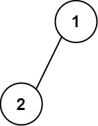

**题目难度：**[输出二叉树](https://leetcode.cn/problems/print-binary-tree/) 中等

**题目描述：**

> 给你一棵二叉树的根节点 root ，请你构造一个下标从 0 开始、大小为 m x n 的字符串矩阵 res ，用以表示树的 格式化布局 。构造此格式化布局矩阵需要遵循以下规则：
> 
> - 树的 高度 为 height ，矩阵的行数 m 应该等于 height + 1 。
> - 矩阵的列数 n 应该等于 2height+1 - 1 。
> - 根节点 需要放置在 顶行 的 正中间 ，对应位置为 res[0][(n-1)/2] 。
> - 对于放置在矩阵中的每个节点，设对应位置为 res[r][c] ，将其左子节点放置在 res[r+1][c-2height-r-1] ，右子节点放置在 res[r+1][c+2height-r-1] 。
> - 继续这一过程，直到树中的所有节点都妥善放置。
> - 任意空单元格都应该包含空字符串 "" 。
> 
> 返回构造得到的矩阵 res 。

**测试用例：**

> 示例 1:
>
> 
> 
> 输入：root = [1,2]
> 
> 输出：
> 
> [["","1",""],
> 
> ["2","",""]]


> 示例 2：
> 
> 
> 
> 输入：root = [1,2,3,null,4]
> 
> 输出：
> 
> [["","","","1","","",""],
> 
> ["","2","","","","3",""],
> 
> ["","","4","","","",""]]


**限制及提示：**
> - 树中节点数在范围 [1, 210] 内
> - -99 <= Node.val <= 99
> - 树的深度在范围 [1, 10] 内

---
**解题分析及思路：**

本题可以采用[深度优先遍历](../method/dfs.md)来进行解答

首先使用dfs获取树的最大深度`height`
```go
var getDepth func(node *TreeNode) int
getDepth = func(node *TreeNode) int {
    if node == nil {
        return 0
    }
    left := getDepth(node.Left)
    right := getDepth(node.Right)
    if left > right {
        return left + 1
    }
    return right + 1
}
// 获取最大深度
height := getDepth(root)
```
然后根据当前节点与子节点的位置关系算出子节点的位置，然后为子节点在结果集中赋值即可

```go
var setValue func(node *TreeNode, r, c int)
setValue = func(node *TreeNode, r, c int) {
    ans[r][c] = strconv.Itoa(node.Val)
    if node.Left != nil {
        setValue(node.Left, r+1, c-1<<(height-r-2))
    }
    if node.Right != nil {
        setValue(node.Right, r+1, c+1<<(height-r-2))
    }
}
setValue(root, 0, (n-1)/2)
```


注意：这里得到的`height`与题目中的`height`差一，在计算坐标减一即可。

[源代码](https://github.com/lomtom/algorithm-go/blob/main/leetcode/655输出二叉树_test.go)

**复杂度：**
- 时间复杂度：O(height*2^height)
- 空间复杂度：O(height)

**执行结果：**

- 执行用时：0 ms, 在所有 Go 提交中击败了100.00%的用户
- 内存消耗：2.2 MB, 在所有 Go 提交中击败了80.95%