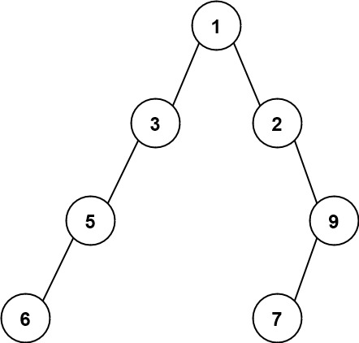

**题目难度：**[二叉树最大宽度](https://leetcode.cn/problems/maximum-width-of-binary-tree/) 中等

**题目描述：**

> 给你一棵二叉树的根节点 root ，返回树的 最大宽度 。
> 
> 树的 最大宽度 是所有层中最大的 宽度 。
> 
> 每一层的 宽度 被定义为该层最左和最右的非空节点（即，两个端点）之间的长度。将这个二叉树视作与满二叉树结构相同，两端点间会出现一些延伸到这一层的 null 节点，这些 null 节点也计入长度。
> 
> 题目数据保证答案将会在  32 位 带符号整数范围内。


**测试用例：**

> 
> 示例 1：
>
> 
> 
> 输入：root = [1,3,2,5,3,null,9]
> 
> 输出：4
> 
> 解释：最大宽度出现在树的第 3 层，宽度为 4 (5,3,null,9) 。

 
> 示例 2：
> 
> 
> 
> 输入：root = [1,3,2,5,null,null,9,6,null,7]
> 
> 输出：7
> 
> 解释：最大宽度出现在树的第 4 层，宽度为 7 (6,null,null,null,null,null,7) 。

> 示例 3：
>
> 
> 
> 输入：root = [1,3,2,5]
> 
> 输出：2
> 
> 解释：最大宽度出现在树的第 2 层，宽度为 2 (3,2) 。

**限制及提示：**
> - 树中节点的数目范围是 [1, 3000]
> - -100 <= Node.val <= 100

---
**解题分析及思路：**

本题采用[二叉树](../datastruct/bTree.md)的层级遍历进行解答

在遍历的同时，为每一个节点进行编号，遍历每一层计算当前节点的编号

- 根节点默认编号为`1` 
- 当前节点为父节点（index）的左节点，则当前节点的编号为`2*index`
- 当前节点为父节点（index）的右节点，则当前节点的编号为`2*index+1`

遍历每一层，算出这一层的最左边节点的编号`left`，再遍历得到最右边节点的编号`right`，那么该层的宽度等于`right - left + 1`。

遍历整棵树的每一层，计算每一层的宽度，得到最大宽度。

```go
func widthOfBinaryTree(root *TreeNode) (ans int) {

	type Pair struct {
		*TreeNode
		index int
	}

	queue := []Pair{{
		root,
		1,
	}}

	for len(queue) > 0 {
		l := len(queue)
		left := queue[0].index
		right := left
		for i := 0; i < l; i++ {
			if queue[i].Left != nil {
				queue = append(queue, Pair{
					queue[i].Left,
					queue[i].index * 2,
				})
			}
			if queue[i].Right != nil {
				queue = append(queue, Pair{
					queue[i].Right,
					queue[i].index*2 + 1,
				})
			}
			right = queue[i].index
		}
		width := right - left + 1
		if width > ans {
			ans = width
		}
		queue = queue[l:]
	}
	return
}
```

此题最开始未考虑空节点，可能直接遍历每一层的节点数就会有误，其实部分空节点也要计算在内，例如：某一层：`1,2,null,null,3`，这种宽度为5，而不是3

[源代码](https://github.com/lomtom/algorithm-go/blob/main/leetcode/662二叉树最大宽度_test.go)

**复杂度：**
- 时间复杂度：O(n)
- 空间复杂度：O(n)

**执行结果：**

- 执行用时：4 ms, 在所有 Go 提交中击败了88.43%的用户
- 内存消耗：4.4 MB, 在所有 Go 提交中击败了60.26%的用户